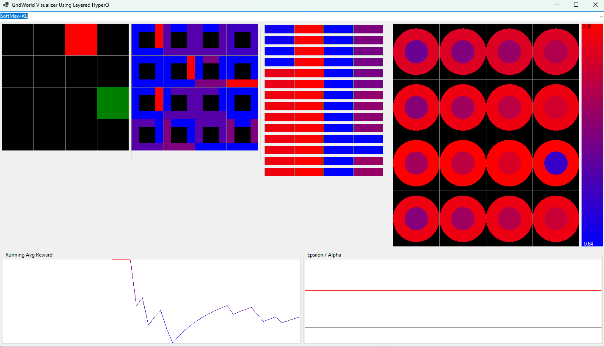

# HyperQ OSS

This is a .NET 10-focused OSS slice of HyperQ. It keeps the core learner libraries and the sample environments that are most suitable for public release:

- GridWorld
- GridWorld Visualizer
- LEM
- HuntTheWumpus
- HuntTheWumpus Visualizer
- MultiHead learners

The closed-source licensing integration, prebuilt binaries, legacy project files, and experimental/distributed samples are intentionally not included in this directory.



## License

HyperQ OSS is licensed under the GNU General Public License version 3.0 only. See [LICENSE](LICENSE).

The OSS build performs no license checks. `HyperQ.Util.Licensing.FeatureGate` is the hook the commercial distribution uses to enforce entitlements; here it stays at its allow-all default.

## Release Status

This tree is suitable for an initial source release, but should be presented as an early OSS release rather than a finished 1.0 API. It builds cleanly on .NET 10, includes focused samples, and persists every learner through a typed checkpoint format rather than binary serialization.

## Documentation

- [Documentation index](docs/README.md)
- [Quickstart](docs/quickstart.md)
- [Q learners](docs/q-learners.md)
- [Action selectors](docs/action-selectors.md)
- [SARSA, MACE, and environments](docs/trainers-and-environments.md)
- [Visualizers](docs/visualizers.md)
- [Checkpoints](docs/checkpoints.md)
- [Release checklist](docs/release-checklist.md)

## Build

```powershell
dotnet build HyperQ.OSS.sln
```

## Run Samples

```powershell
dotnet run --project samples/GridWorld/GridWorld.csproj
dotnet run --project samples/GridWorld.Viz/GridWorld.Viz.csproj
dotnet run --project samples/LEM/LEM.csproj -- 10 1 dyna_size=0 memory=0 warmup=0
dotnet run --project samples/HuntTheWumpus/HuntTheWumpus.csproj -- 10 1 dims=4x4 dyna_size=0 memory=0 warmup=0
dotnet run --project samples/Wumpus.Viz/Wumpus.Viz.csproj
```

The LEM and HuntTheWumpus runners persist their learners through the typed checkpoint format: `save=<file>` writes a compressed `.gz` checkpoint after training and `load=<file>` restores one into the learners configured on the command line before training. See [Checkpoints](docs/checkpoints.md).

## Checkpoints

Every learner implements `HyperQ.Util.ICheckpointable`, and two containers wrap the raw checkpoints in a self-describing file:

- `HyperQ.Learners.LearnerCheckpoint`: one component (a learner or a stateful selector) with a magic string, format version and type name; `.gz` names are compressed.
- `HyperQ.MACE.MACECheckpoint`: a set of MACE minds, each learner with its selector.
- `HyperQ.Training.TrainingCheckpoint`: a learner with its hyperparameters, episode count and optional selector, for resuming a training run.

Checkpointable components: `ClassicQ`, `ClassicQQ`, `MappedQ<T>`, `MappedQQ<T>`, `SingleHyperQ<T>`, `DoubleHyperQ<T>`, `LayeredHyperQ<T>`, the ordinal and mapped action spaces (a learner's rows depend on the order actions were first seen, so the mapping is saved with them), `PolicyGradientActionSelector<T>`, `HyperParams`, `QParam` and `RunningLogit`.
